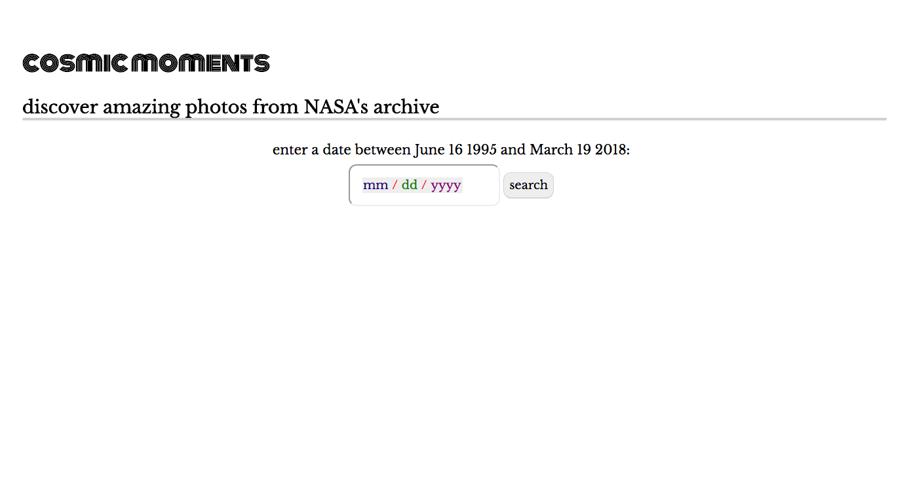
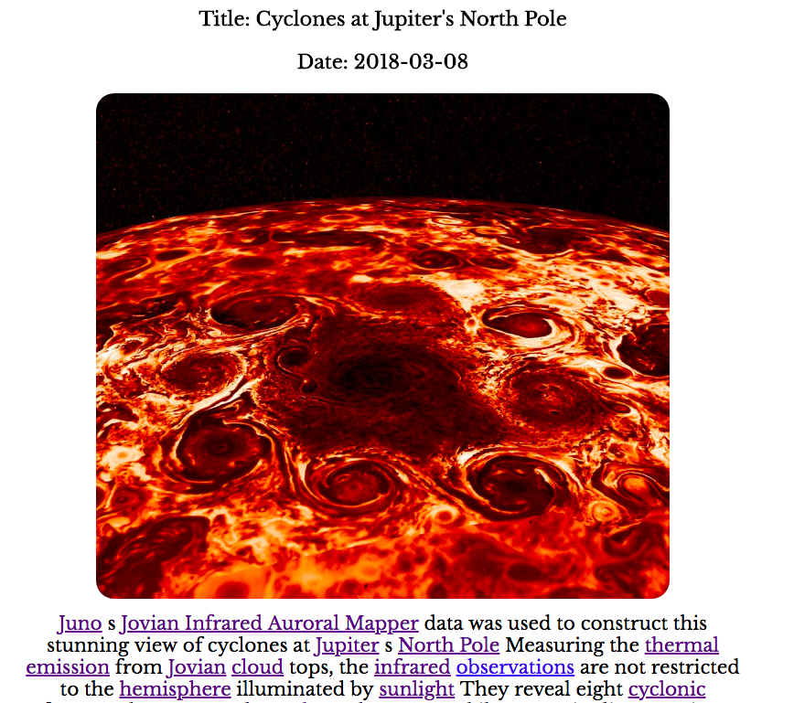
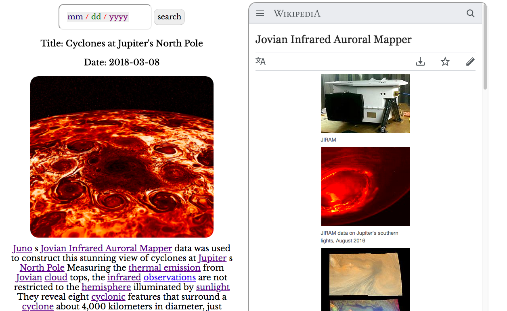
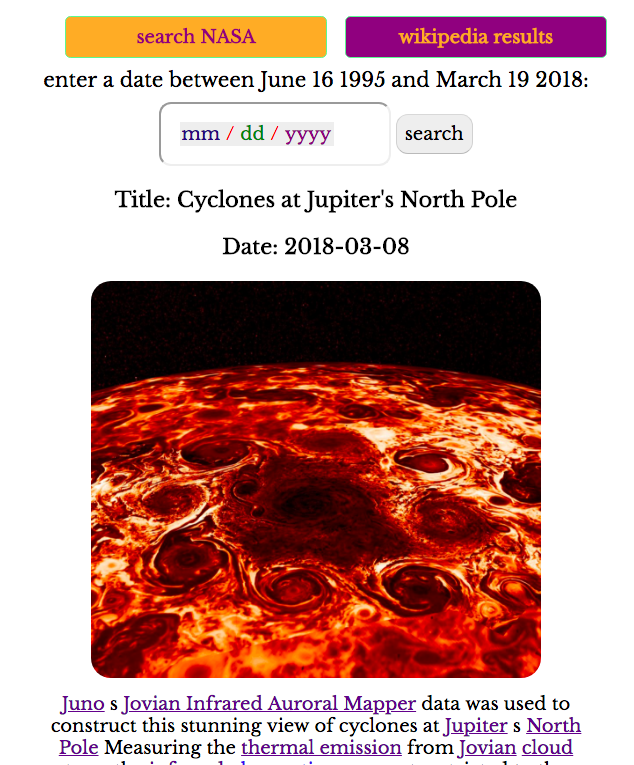
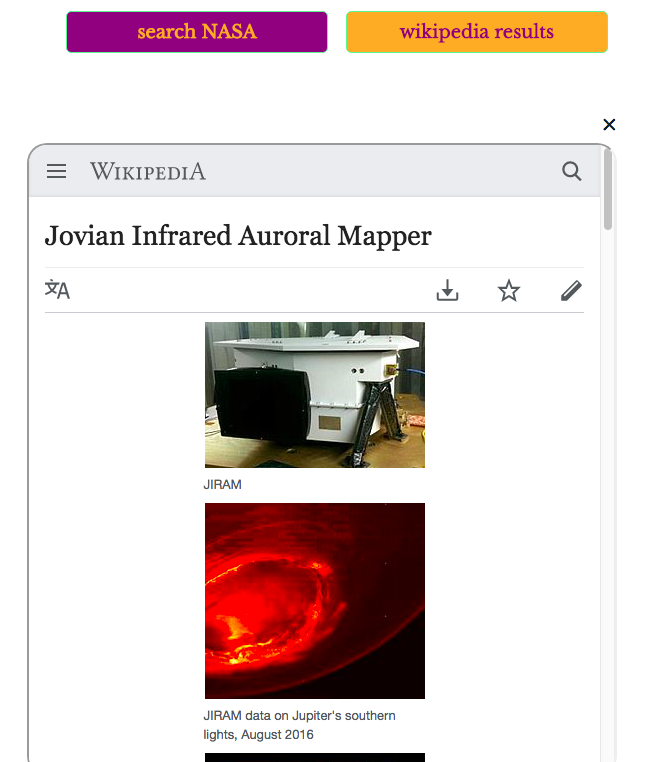

# cosmic-moments
an educational application to learn more about our universe. users can enter a date to search NASA's 'astronomy picture of the day' archive. the explanation accompanying the image has been annotated using the semantics text analyzing Dandelion API. users can click on the annotated link to learn more about the topic. search and retrieval of more information about the topic appears in a second panel and is powered by the Wikipeda API. 

## motivation
i wanted to enable small moments of appreciation for our universe

## screenshots
landing and search page:

initial result with annotated links:

result after click on link for more information:

mobile view:

## built with
*Javascript
*Flex
*JQuery
*HTML5

## features
*search the NASA 'astronomy photo of the day' archive by date to capture a glimpse of our cosmos
*learn more about any topics in the annotated NASA explanation 
